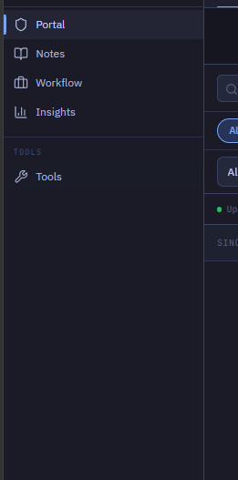
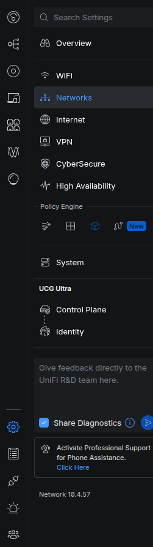
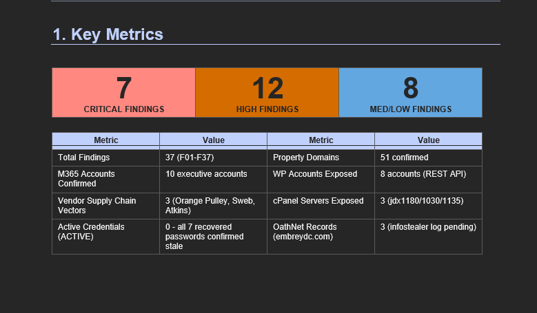
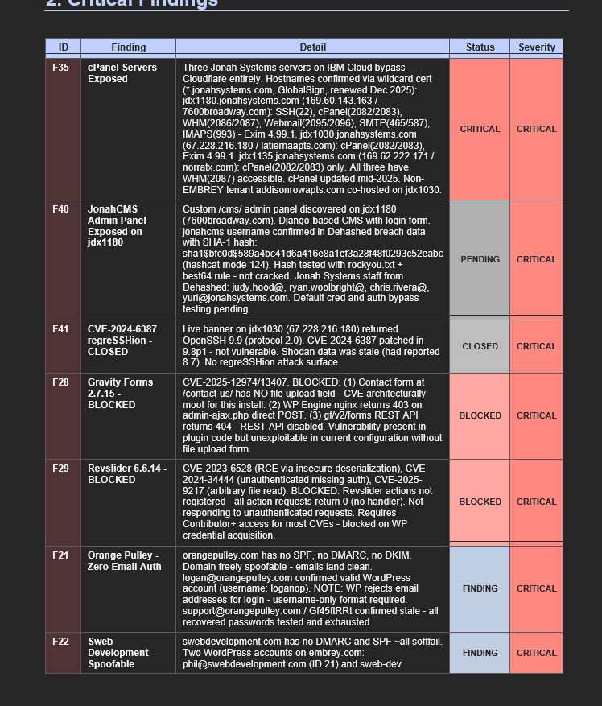
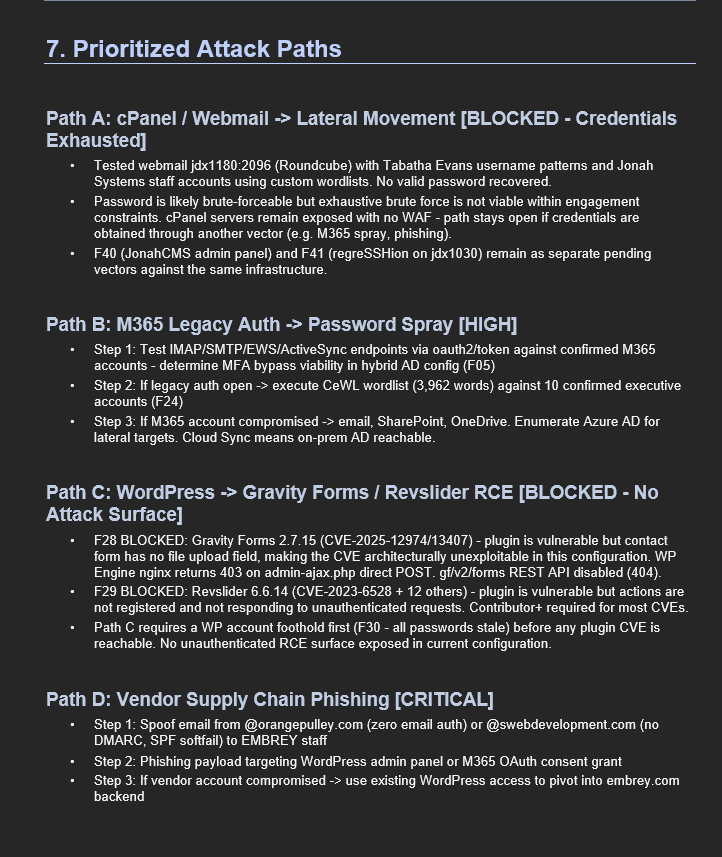
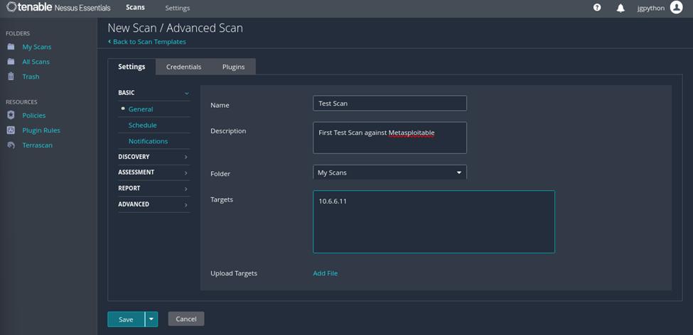
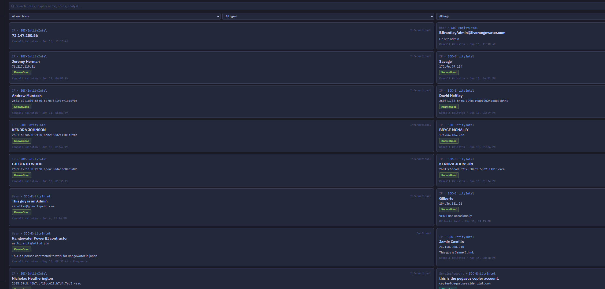

# Red Team Dashboard — Charter

> **What this file is:** the shared idea space for the people building this
> dashboard. It holds our **wants, goals, and vision** in plain language — the
> "what" and "why", not the "how". It is intentionally informal and additive:
> drop your ideas here, sign them, and we converge.
>
> **Companion docs (the "how"):**
> - `docs/ARCHITECTURE_SKETCH_V2.md` — the technical target (data model, agents,
>   flows). When an idea here is agreed and detailed enough, it graduates into
>   the sketch.
> - `docs/ENTRA_SETUP.md`, `docs/DEPLOY.md` — operational setup.
>
> **How to contribute:** add a bullet/section under *Open ideas*, prefix new
> items with your initials + date, and don't be shy. Disagreements are captured
> as *Open questions / tensions* rather than silently resolved.

---

## North Star

**An analyst should be able to do everything they need — and see everything
they need — from within this one portal.** One pane of glass. No tool-hopping,
no hunting across screens for the next action.

### Guiding principles
- **Findings first.** The work product (findings) is the center of gravity, not
  a buried tab.
- **Feedback loop.** Anything found becomes a *finding* → a finding suggests
  *tasks* → acting on tasks produces more findings → the table updates. The loop
  keeps turning for the life of the engagement.
- **Analyst in control, agents assist.** Automation accelerates; the analyst
  decides. **Agents do enumeration & scanning only — never exploitation.**
- **Whole-page navigation, not nested scrolling.** Moving between areas should
  feel like changing pages, not scrolling through stacked panels.

---

## Where we are today (so the contributor has context)

Already built / in flight on feature branches (`phase-7-pivot`, `phase-8-tabbed-findings`):
- **Single-tenant pivot**: one hosted dashboard, **Entra (Microsoft) SSO** per
  analyst; the old multi-"source" model is retired.
- **Look**: all-black monochrome theme + a single ember accent.
- **Engagement page**: tabbed shell (OSINT · Vuln Scan · Exploit · Phishing ·
  Results · Costs) — *currently top tabs; this charter proposes moving to a left
  nav (see Idea 0).*
- **Findings backend (Phase 8a)**: findings are phase-tagged and gated behind
  analyst **validation** (pending → validated); only validated findings hit the
  PDF report.
- **Agents (planned)**: a **Strategic** watcher (logs/plans/suggests, never
  acts) + a **Tactical** manager (auto-dispatches scan/enum workers, gated).

---

## Open ideas & wants

> Captured from Nasir's notes, 2026-06-16, with reference screenshots in
> `docs/images/`. Items are written from Nasir's descriptions + those images —
> correct anything misread.

### 0. Design — move navigation to a LEFT sidebar
- **Want:** the portal's sections live in a **left-hand vertical nav**, and
  selecting one swaps the **whole page** (page-level navigation), so we don't
  scroll through nested panels to reach things.
- **References (the feel we want):**

  

  A clean labeled sidebar — icon + label rows (Portal · Notes · Workflow ·
  Insights), a grouped **TOOLS** section, and the **active item marked with a
  vertical accent bar**.

  

  A richer two-level pattern — a thin **icon rail** on the far left plus an
  expanded **grouped section list** (with sub-headers like "Policy Engine"), a
  persistent search box at the top, and settings pinned at the bottom.

- **Takeaway:** dark left sidebar; icon + label; grouped sections with headers;
  active item gets the ember accent; each click is a destination, not a scroll.
- **Status:** proposed — **revises** the Phase 7 top-tab shell.

### 1. Findings front-and-center (and their own database)
- **Want:** opening an engagement shows **findings first** — the very first
  thing the analyst sees.
- **Want:** a **key-metrics strip** up top — severity count cards
  (Critical / High / Med-Low) plus a quick metrics table — then the findings
  table itself.

  

- **Want:** findings render as a **clickable table** with columns roughly:
  **ID · Finding · Detail · Status · Severity** — color-coded status
  (CRITICAL / PENDING / CLOSED / BLOCKED / FINDING) and severity. (We don't need
  this exact styling, but it must be a table in this spirit.)

  

- **Want:** findings get **their own database/table** so they're easy to query
  and access directly (not buried inside run/event payloads).
- **Status:** backend partially there (Phase 8a gave findings phase + validation
  status + a clean `findings` store, `ID`-style addressing, status). The
  metrics strip + findings-table-first landing is **proposed** frontend work.

### 2. Modular, clickable findings → suggested attack path
- **Flow:**
  1. Analyst **clicks a finding** in the table.
  2. A **box/window opens** showing a **suggested attack path**.
  3. At the **bottom**, two buttons: **Analyst** (do it manually from the shown
     steps) or **Agent** (let the **Tactical** agent run the steps).
- **Structure** — steps are grouped into **named Paths**, and each Path contains
  ordered **Tasks/Steps**. A finding may map to several paths. This is exactly
  the shape of our report's "Prioritized Attack Paths":

  

  Each Path has a **name + a status/severity tag** (e.g. *"Path B: M365 Legacy
  Auth → Password Spray [HIGH]"*) and a list of **Steps** (Step 1, 2, 3…).

- **Box vs. window:** implementer's choice — leaning a **slide-over panel** so
  the findings table stays visible behind it.
- **Status:** proposed. Refines `ARCHITECTURE_SKETCH_V2.md` §6 (actionable
  findings) — now with **named Paths containing Tasks** + a per-path
  Analyst/Agent choice.
- ✅ **Decided (safety):** the **Agent** button only runs **scan/enumeration**
  tasks. **Exploitation tasks are Analyst-only** — agents never exploit
  (confirmed 2026-06-16). So on an exploitation Path the Agent button is
  disabled / not offered; the analyst works those steps manually and uploads
  results.

### 3. Nessus-style engagement creation / overview
- **Want:** creating a new engagement opens a **setup/overview page** (à la
  Tenable Nessus' "New Scan") where the analyst sets **Name**, **Description**,
  and **Targets (scope)**, then clicks **"Save and start"** — which **kicks off
  OSINT on the provided scope** automatically.

  

  Note the shape: a left sub-nav (Basic → General/Schedule/…, Discovery,
  Assessment, Report, Advanced), a simple form (Name, Description, Folder,
  Targets textarea, optional file upload), and **Save / Cancel** at the bottom.
- **Want:** behave *like* Nessus, but **not** all its features — just the clean
  "configure → save & launch" feel.
- **Then:** once OSINT starts, **findings begin populating** and are the first
  thing the analyst sees (ties back to Idea 1).
- **Status:** proposed. New engagement-setup page + auto-launch OSINT on save.

### 4. Entities tab — entity correlation
- **Want:** a dedicated area for **all entities discovered** across findings —
  emails, passwords, usernames, IPs, service accounts, people, and any other
  disclosed entities.
- **Want:** a **search bar** + **filters** (by watchlist / type / tags) over a
  feed of **entity cards**, each **clickable** to open full details (where it
  came from, related findings, notes, the contributing analyst, timestamps).

  

  Each card carries an entity type (person / user-email / IP / service account),
  the value, info tags, and provenance.
- **Why:** correlation — everything we know about a person/asset in one place.
- **Status:** proposed. Implies extracting structured entities from findings
  into their own store (entity ← finding linkage), with search + type filters.

### 5. The feedback loop (cross-cutting)
- **Want:** the whole portal behaves as a **continuous loop**: *found →
  finding → tasks → table updates → act → found again.* New information should
  always flow back onto the findings table and the entity view in near-real time.
- **Status:** principle; threads through Ideas 1–4 and the Strategic/Tactical
  agents.

---

## Decided

- **Agents scan & enumerate only; analysts exploit.** The Agent button on an
  attack path is limited to scan/enum tasks; exploitation is Analyst-only and
  its results are uploaded. (2026-06-16)

## Open questions (for us to settle together)

1. **Box vs. window vs. page** for the attack-path view (Idea 2). Leaning
   slide-over panel.
2. **Left-nav vs. top-tabs** — confirm the switch (Idea 0); does anything stay a
   sub-tab, or is everything page-level?
3. **Entity extraction** — automatic parsing from findings, analyst-tagged, or
   both? (Idea 4)
4. **"Findings own database"** — a dedicated normalized schema vs. the current
   `findings` table made first-class. (Idea 1)

---

## Parking lot (raise anytime)

- _(contributor: add your ideas here — initials + date)_

---

*Living document. Last updated 2026-06-16. Maintainers: Nasir + contributor.*
